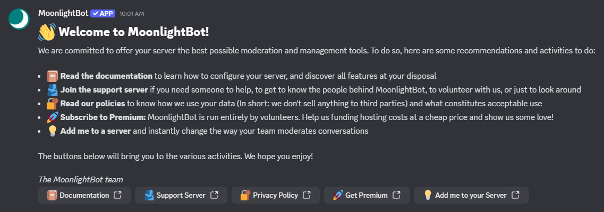

# MoonlightBot Documentation

Welcome to the documentation for MoonlightBot! MoonlightBot is a powerful moderation bot for Discord with a focus on user-friendliness and efficiency. It's simple to use and easy to set up, and is run and maintained entirely by volunteers. This documentation will teach you everything you need to know to use it to its fullest potential.

## Getting Started

First, add the bot to your server using [this invite link](https://discord.com/api/oauth2/authorize?client_id=314110696071888896&permissions=1512298638534&scope=applications.commands%20bot). It's recommended (but not required) that you grant it all permissions it requests, so all its features will work correctly.

 You can only add bots to servers in which you have the Manage Server permission. 

Once you've added it to your server, you can verify that it's working by using the `/ping` command, which simply checks the bot's latency.


If this is your first time using MoonlightBot, you'll receive a Direct Message welcoming you to the bot and providing several recommendations, including reading the [Acceptable Use Policy](./policies/acceptable-use-policy.md). Please read this carefully, as a violation of the Acceptable Use Policy can result in you being banned from using the service.



We suggest that you also review the [Moderation Tutorial](./start-up/moderation-tutorial.md) and share it with your server moderators and administrators following the configuration of the bot.

## Temporary Roles

The bot can assign and remove specified roles to a user temporarily.

* You can assign or remove a temporary role to a user with [`/temprole`](./role-management-commands/temprole.md)
* All temporary roles currently active in the server can be listed with [`/list-temproles`](./role-management-commands/list-temproles.md)
* You can permanently assign or remove any role to a user with [`/role`](./role-management-commands/role.md)
* Users can assign and remove selected roles to themselves with [`/selfrole`](./role-management-commands/selfrole.md)
* You also have the option of using [Reaction Roles](./start-up/setting-up-reaction-roles.md) in place of the `/selfrole` command
* A role assigned to a user can automatically be changed to a temporary role with the [`roles detect-assignment` config option](./management-commands/config.md#roles-detect-assignment)
* Any role assigned to a user can also be temporarily removed with [`/pause-role`](./role-management-commands/pause-role.md)

## Command Permissions

MoonlightBot uses Discord's built-in permissions system to configure who should and should not be able to execute certain commands. Some commands have required permissions set up by default, and all commands can have permissions overridden for specific roles or users. To set up permissions properly, follow the [Permission Tutorial](./start-up/permission-tutorial.md).

## Logging

The bot has configurable logging, and can log several kinds of actions to one or more channels. To enable and configure logging for a specific channel, use the command
```
/config channels channel:LOG-CHANNEL logs:Open editor
```
where `LOG-CHANNEL` is the channel you want logs posted to.

It will ask you for the log actions, and you can enter your choice of items or categories from the [list of log names](./advanced/list-of-log-names.md) or simply enter an asterisk (`*`) to log everything. The list of items and categories to log should be separated by commas and spaces, like so: `BAN, KICK, USER_JOIN, USER_LEFT`

## Mute Setup

The bot can mute users both temporarily and permanently. To use mute features, use the command
```
/create-muterole
```
to automatically create a mute role with the correct permissions. You can specify a role to be used, or leave it blank and the bot will automatically create a new role.


You should now be able to use [`/mute`](./moderation-commands/mute.md),  [`/tempmute`](./moderation-commands/tempmute.md), and [`/unmute`](./moderation-commands/unmute.md).

## Changing the Bot's Language

The bot supports multiple languages in its responses. This can be set globally for the server, or specifically for you. You can set this by using
```
/config settings locale:LANG
```
for server-wide configuration, or
```
/userconfig settings locale:LANG
```
for user-specific configuration, where `LANG` is the language you want MoonlightBot to respond in.

You can find a list of all valid languages [on the Discord Developer Portal](https://discord.com/developers/docs/reference#locales). Locale, Language Name, and Native Name are all valid inputs. You can also use `auto` and MoonlightBot will attempt to auto-detect your preferred language from your Discord settings.

 MoonlightBot is translated entirely by volunteers, so not all languages are complete and some may have translation errors. If you speak one of the supported languages proficiently and would like to help us translate MoonlightBot, [please consider becoming a volunteer!](./support/volunteering.md) 

## Support the Development of MoonlightBot

MoonlightBot is run and maintained by volunteers, and is currently funded entirely by [Premium Subscriptions](./support/premium.md). These subscriptions help us fund hosting and give you great benefits, making them a fantastic way to support us. You can also help by [upvoting the bot](./support/upvote-moonlightbot.md) on bot lists or by [joining our team of testers, translators, and documentation writers](./support/volunteering.md).

## Questions? Problems?

Please [read the Frequently Asked Questions first](./start-up/faqs.md) to see if your question or problem is answered there. If your question or problem is still unanswered, [join the support server](https://discord.gg/hNQWVVC) and we will help you as best we can!