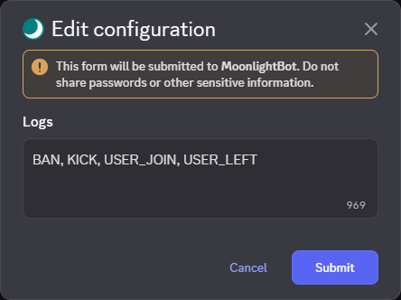
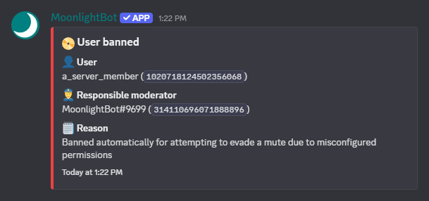

# MoonlightBot Documentation

Welcome to the documentation for MoonlightBot! MoonlightBot is a powerful moderation bot for Discord with a focus on user-friendliness and efficiency. It's simple to use and easy to set up, and is run and maintained entirely by volunteers. This documentation will teach you everything you need to know to use MoonlightBot to its fullest potential.

## Getting Started

First, add MoonlightBot to your server using [this invite link](https://discord.com/api/oauth2/authorize?client_id=314110696071888896&permissions=1512298638534&scope=applications.commands%20bot). It is recommended (but not required) that you grant all requested permissions to ensure all features work correctly.

 You can only add bots to servers in which you have the Manage Server permission. 

Once you've added MoonlightBot to your server, you can verify that it's working by using the [`/ping`](./miscellaneous-commands/other-minor-commands.md#ping) command.


If this is your first time using MoonlightBot, you'll receive a Direct Message welcoming you to the bot and providing several recommendations, including reading the [Acceptable Use Policy](./policies/acceptable-use-policy.md). Please read this carefully, as a violation of the Acceptable Use Policy can result in you being banned from using the service.


We also suggest that you review the [Moderation Tutorial](./start-up/moderation-tutorial.md) and share it with your server moderators and administrators once you've finished configuring MoonlightBot.

## Changing the Bot's Language

MoonlightBot supports multiple languages for its commands and responses, and can be set server-wide or per-user. Set the language using
```
/config settings locale:LANG
```
for server-wide configuration, or
```
/userconfig settings locale:LANG
```
for user-specific configuration, where `LANG` is the language you want MoonlightBot to respond in.

A list of supported languages is available on the [Discord Developer Portal](https://discord.com/developers/docs/reference#locales); Locale, Language Name, and Native Name are all valid inputs. Alternatively, `auto` can be used for MoonlightBot to detect your preferred language from your Discord settings.

 MoonlightBot is translated entirely by volunteers, so not all languages are complete and may have translation errors. If you speak one of the supported languages proficiently and would like to help us translate MoonlightBot, <a href="./support/volunteering.md">please consider becoming a translator!</a> 

## Temporary Roles

The bot can assign and remove specified roles to a user temporarily.

* You can assign or remove a temporary role to a user with [`/temprole`](./role-management-commands/temprole.md)
* All temporary roles currently active in the server can be listed with [`/list-temproles`](./role-management-commands/list-temproles.md)
* You can permanently assign or remove any role to a user with [`/role`](./role-management-commands/role.md)
* Users can assign and remove selected roles to themselves with [`/selfrole`](./role-management-commands/selfrole.md)
* You also have the option of using [Reaction Roles](./start-up/setting-up-reaction-roles.md) in place of the `/selfrole` command
* A role assigned to a user can automatically be changed to a temporary role with the [`roles detect-assignment` config option](./management-commands/config.md#roles-detect-assignment)
* Any role assigned to a user can also be temporarily removed with [`/pause-role`](./role-management-commands/pause-role.md)

## Command Permissions

MoonlightBot uses Discord's built-in permissions system to control who is and is not be able to execute certain commands. Some commands have required permissions set by default, and overrides for specific members and roles can be applied to any and all commands. To set up permissions properly, please follow the [Permission Tutorial](./start-up/permission-tutorial.md).

## Logging

MoonlightBot offers highly-configurable logging, and can log several kinds of actions to one or more channels. To enable and configure logging for a specific channel, use the command
```
/config channels channel:LOG-CHANNEL logs:Open editor
```
where `LOG-CHANNEL` is the channel you want logs posted to.

An editor will open where you can enter items or categories from the [list of log names](./advanced/list-of-log-names.md), or an asterisk (`*`) to log everything. The list of items and categories to log should be separated by commas and spaces, like so: `BAN, KICK, USER_JOIN, USER_LEFT`



## Mute Setup

MoonlightBot can mute members both temporarily and permanently. Use the command
```
/create-muterole
```
to set up a mute role. Specifying the `role` [option](./start-up/options.md) allows you to set up an existing role, or you can leave it out to create a new `@Muted` role.


You will now be able to use [`/mute`](./moderation-commands/mute.md),  [`/tempmute`](./moderation-commands/tempmute.md), and [`/unmute`](./moderation-commands/unmute.md).

## Evasion Bans

 Evasion Bans can only be set up with <a href="./support/premium.md">MoonlightBot Premium</a>. If you think this feature can help you, <a href="./support/upvote-moonlightbot.md">vote for MoonlightBot</a> to earn an infinitely extendable free trial. 

Evasions bans are a fallback moderation feature to ensure muted members cannot abuse improperly configured permissions by escalating a mute punishment to a harsher ban. If a user with your server's mute role sends a message in a channel that hasn't been allowed, they will be banned. To enable evasion bans, use the command
```
/config settings mute-evasion-ban:True
```
All channels will now be monitored for new messages sent by muted members. To create an exception to the evasion ban and allow muted members to talk in a channel, use
```
/config channels channel:IGNORED-CHANNEL ignore-mute-evasion-ban:True
```
where `IGNORED-CHANNEL` is the channel you want ignored. Ignoring a channel will also ignore threads made in the channel.

It is recommended to set up at least one [logging channel](./README.md#logging) with the `BAN` log enabled to see when an evasion ban is triggered.



## Support the Development of MoonlightBot

MoonlightBot is run and maintained by volunteers, and is funded entirely by [Premium Subscriptions](./support/premium.md). These subscriptions help us fund hosting and give you great benefits, making them a fantastic way to support us. You can also help by [upvoting the bot](./support/upvote-moonlightbot.md) or by [joining our team of testers, translators, and documentation writers](./support/volunteering.md).

## Questions? Problems?

Please read the [Frequently Asked Questions](./start-up/faqs.md) first to see if your question or problem is answered there. If your question or problem is still unanswered, [join the support server](https://discord.gg/hNQWVVC) and we will help you as best we can!